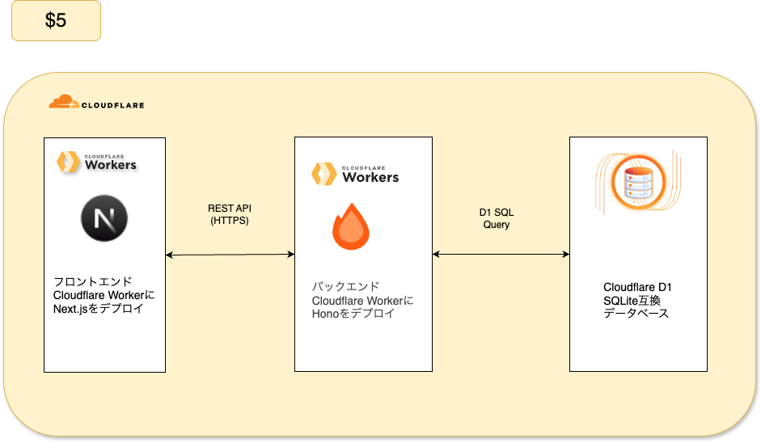

- このリポジトリは[こちらのZennの記事](https://zenn.dev/fatricepaddyy/books/cf_sample_app)の成果物です
- Cloudflare × TypeScript での Web ページの認証付きテンプレートです

# アーキテクチャー


```bash

├── apps
│   ├── backend
│   │   ├── drizzle/ # マイグレーションファイルやスナップショット
│   │   ├── src/
│   │   │   ├── index.ts # エンドポイントのエントリーポイント
│   │   │   ├── lib/
│   │   │   ├── middlewares/
│   │   │   ├── routes/ # エンドポイントの定義を書く
│   │   ├── tsconfig.json
│   │   ├── worker-configuration.d.ts
│   │   └── wrangler.jsonc
│   └── frontend/ # フロントエンド
├── docs
│   ├── architecture.drawio
│   ├── project-architecture.png
│   └── setup.md
├── package.json
├── pnpm-lock.yaml
├── pnpm-workspace.yaml
└── README.md

```

# セットアップ方法
セットアップ手順は [docs/setup.md](docs/setup.md) を参照してください。

# 技術スタック
| 技術 | バージョン | 補足 |
| --- | --- | --- |
| Cloudflare Workers | Wrangler 4.45.0 | 低コストで、エッジで高速に動かせるため |
| Cloudflare D1 | バージョンなし | 低コストで、Workers と近い場所に置けるため低レイテンシにしやすいため |
| Hono | 4.11.1 | Hono RPC が使いやすく、薄いフレームワークで自由度が高いため |
| OpenAPI Hono | `@hono/zod-openapi` 1.1.5 | OpenAPI 定義と型を一緒に管理しやすく、API ドキュメント生成もしやすいため |
| Next.js | 15.4.6 | 機能が豊富で、情報量が多く AI コーディング支援とも相性が良いため |
| Better Auth | 1.3.32 | 認証に必要な機能が揃っており、セッション管理まで含めて組み込みやすいため |
| Drizzle | `drizzle-orm` 0.44.7 / `drizzle-kit` 0.31.5 | エッジで動かすことができ、スキーマからクエリまで型安全に扱いやすいため |

# 制作背景
- 課題: Cloudflare Workers用のモノレポのStarter Kitが存在しない
- 目的: Cloudflare Workers用のモノレポのStarter Kitにより、今後の新プロジェクトの開発速度向上
